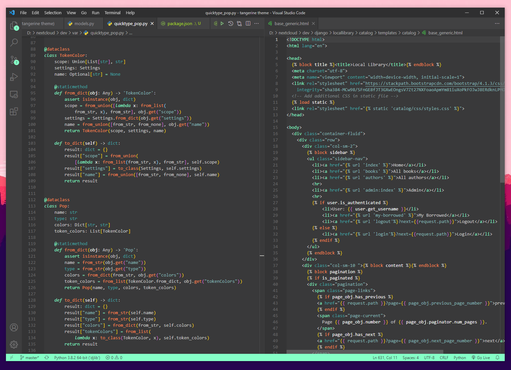

# Tangerine Theme for VS Code
## Origin
This theme is basically a polished version of Tickle color theme from [Rainglow themes pack by Dayle Rees](https://github.com/rainglow/vscode).

Main coloring scheme has been tweaked just a tiny bit to address some Python/Django issues (including Django HTML Templates available with [Djaneiro](https://github.com/ScottBarkman/vscode-djaneiro) extension).
JSON scopes have been reworked significantly to reflect nesting levels. CSS scopes added for fancier and more distinguishable selectors. A lot of scopes definitions borrowed from the amazing [Pop! Theme dark](https://github.com/ArtisanByteCrafter/VSCodePopTheme).

## Screenshots



## Installation

Launch *Quick Open*

  -  <a href="https://code.visualstudio.com/shortcuts/keyboard-shortcuts-linux.pdf">Linux</a> `Ctrl+P`
  -  <a href="https://code.visualstudio.com/shortcuts/keyboard-shortcuts-macos.pdf">macOS</a> `⌘P`
  -  <a href="https://code.visualstudio.com/shortcuts/keyboard-shortcuts-windows.pdf">Windows</a> `Ctrl+P`

Paste the following command and press `Enter`:

```
ext install jetpackguy.tangerine
```

- Or you could just open the Extensions tab on VS Code and search for "Tangerine Theme".


To change color theme: `ctrl+K ctrl+T` then select Tangerine


## Contribution
If you want to improve this theme or suggest some new rules for your favorite language please do not hesitate to drop me a line [@issues](https://github.com/jetpackguy/tangerine-theme/issues)

## License
[MIT](https://github.com/jetpackguy/tangerine-theme/blob/master/LICENSE)

**Enjoy!**
